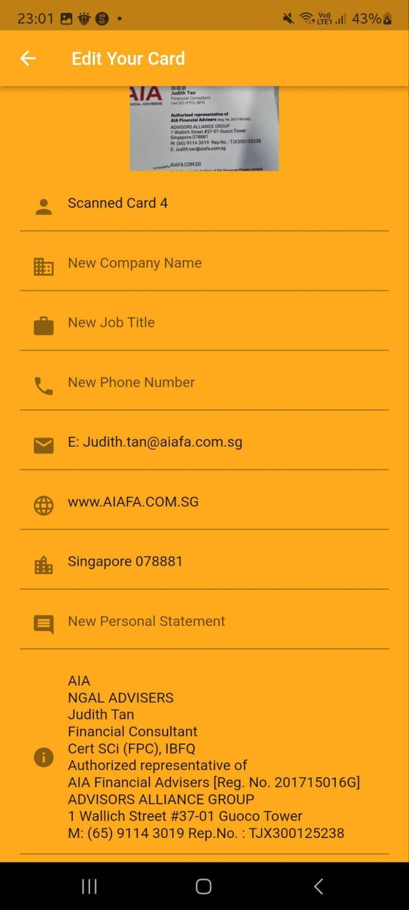

**National University of Singapore (NUS)**

**CP2106 (Orbital)**

**Quah Han Rong, Glenn (Skylab ID: 5132)**

**Tan Zhi Wei (Skylab ID: 5133)**

**Team ID: 5548**

**Proposed Level ofAchievement: Apollo 11**

**Difficulty Attempted: Advanced**

**Year: 2023**

**Table of Contents**

[TOC]

# 

# 1.0 Foreword by Developers

Welcome to ConnectCard! This namecard application is designed to revolutionize the way you exchange and manage contact information.

As developers, we embarked on this journey with a simple yet powerful idea – to create a seamless and digital solution for sharing your professional identity. In today's fast-paced world, where networking and connections play a vital role, we recognized the need for a modern approach to exchanging contact details. 

Gone are the days where you carry around a physical namecard. With ConnectCard, you are able to showcase your unique brand and professional identity anytime and anywhere. By seamlessly scanning a QR Code, your namecard information can be exchanged easily.

We have poured our hearts and expertise into every aspect of this application, ensuring that it delivers a delightful user experience. Our focus on simplicity and intuitive design means that anyone, regardless of their technical proficiency, can effortlessly navigate and make the most of our application.

But our journey does not end here. We are committed to continuous improvement and evolution, guided by your valuable feedback and suggestions. Our passion for innovation and our dedication to providing a cutting-edge product drive us to push the boundaries of what this application can achieve.

So, without further ado, welcome to ConnectCard –** Networking made easy**

Regards,

Glenn Quah

Linkedln: [https://www.linkedin.com/in/glenn-quah-59390a18b/](https://www.linkedin.com/in/glenn-quah-59390a18b/)

Github: [https://github.com/glennquah](https://github.com/glennquah) 

Tan Zhi Wei

Linkedln: [https://www.linkedin.com/in/zhi-wei-tan-92b02525b/](https://www.linkedin.com/in/zhi-wei-tan-92b02525b/) 

Github: [https://github.com/ZhiWei1010](https://github.com/ZhiWei1010) 

# 2.0 Poster & Video

To watch the video of ConnectCard & view the poster, click the following link!

## 2.1 LiftOff

Elevator Pitch Video: [https://drive.google.com/file/d/1KqCCN2fL1QiHnOnuNatBzYJn6tmiY9W4/view?usp=share_link](https://drive.google.com/file/d/1KqCCN2fL1QiHnOnuNatBzYJn6tmiY9W4/view?usp=share_link)

Poster: [https://drive.google.com/file/d/1Xfcv88yRIS-P9JojkY_17qMARUUyWp3c/view?usp=share_link](https://drive.google.com/file/d/1Xfcv88yRIS-P9JojkY_17qMARUUyWp3c/view?usp=share_link)

## 2.2 Milestone 1

Figma Design: [https://www.figma.com/file/hVvHnTKv5smJBOPmTPnpZP/Connect-Card?type=design&node-id=0%3A1&t=8YLkiicqGAFXCIrQ-1](https://www.figma.com/file/hVvHnTKv5smJBOPmTPnpZP/Connect-Card?type=design&node-id=0%3A1&t=8YLkiicqGAFXCIrQ-1)

Project Demo: [https://drive.google.com/file/d/1_FYtio2JPChTIyvzL8KLP-Jp_Hdezmzm/view?usp=sharing](https://drive.google.com/file/d/1_FYtio2JPChTIyvzL8KLP-Jp_Hdezmzm/view?usp=sharing)

Milestone 1 Prototype: [https://drive.google.com/file/d/1_FYtio2JPChTIyvzL8KLP-Jp_Hdezmzm/view?usp=sharing](https://drive.google.com/file/d/1_FYtio2JPChTIyvzL8KLP-Jp_Hdezmzm/view?usp=sharing)

## 2.3 Milestone 2

A1 Poster: [https://drive.google.com/file/d/1MQJMPrQ37ZrNrq_ALeu95r2SLRX-Vr9Z/view?usp=sharing](https://drive.google.com/file/d/1MQJMPrQ37ZrNrq_ALeu95r2SLRX-Vr9Z/view?usp=sharing)

Project Demo: [https://drive.google.com/file/d/1rrZD2IqqNtiWg3TsZ2e1fOy9HcUg8kcs/view?usp=sharing](https://drive.google.com/file/d/1rrZD2IqqNtiWg3TsZ2e1fOy9HcUg8kcs/view?usp=sharing)

App APK: [https://drive.google.com/drive/folders/1gHe2YpPyJYLERWdhZ95dpLA-nPWfbCxl](https://drive.google.com/drive/folders/1gHe2YpPyJYLERWdhZ95dpLA-nPWfbCxl)

## 2.4 Milestone 3

A1 Poster: 

Project Demo: [https://drive.google.com/file/d/1bNgsbRKgLQ5-xu79HLYNc3w_j2NT44GG/view?usp=sharing](https://drive.google.com/file/d/1bNgsbRKgLQ5-xu79HLYNc3w_j2NT44GG/view?usp=sharing)

App APK: [https://drive.google.com/drive/folders/1sdKgctwhZuty5yzFxVUUMiuW6nRoqbCH?usp=drive_lin](https://drive.google.com/drive/folders/1sdKgctwhZuty5yzFxVUUMiuW6nRoqbCH?usp=drive_link)

# 3.0 Deployment

ConnectCard is currently only available on android. For users without an android device, you may download the app through an Android Emulator which can be downloaded from Android Studio. Otherwise, you may read the App Demo/Walkthrough or watch our App Demo Video which can be accessed under Poster & Video.

ConnectCard is packaged into an APK file, where you can download and install the APK on your android device directly.

Link to APK: [https://drive.google.com/drive/folders/1sdKgctwhZuty5yzFxVUUMiuW6nRoqbCH?usp=drive_lin](https://drive.google.com/drive/folders/1sdKgctwhZuty5yzFxVUUMiuW6nRoqbCH?usp=drive_link)

# 4.0 Motivation

## 4.1 Problem:

Carrying physical name cards and membership/loyalty cards can be **burdensome**, leading to **lost contact information and a cluttered wallet**. It is **inconvenient** for individuals who meet new people, engage in business interactions, or collect various membership cards to **manage and access these cards efficiently.**

## 4.2 Solution:

ConnectCard provides a convenient solution by allowing users to scan physical name cards using their phone camera and convert them into digital cards stored within the application. Users can easily update their personal digital name cards, keeping their contact information up to date for seamless interactions. The application also enables users to exchange digital name cards effortlessly, through sending it through a link and using NFC technology. Furthermore, users can store and track their membership or loyalty reward cards digitally, while vendors can update customers' progress in real-time. With our app, individuals can simplify their wallet, stay connected with ease, and take full advantage of membership benefits without the hassle of physical cards.

# 5.0 Aim

The primary objective of our Orbital project is to develop a sophisticated mobile application that facilitates effortless storage and management of personal name cards, along with seamless user connectivity. Our ultimate vision is to eliminate the reliance on physical name cards and alleviate the inconvenience of carrying a bulky wallet through the streamlined functionality of this app. Designed for recruiters, professionals, job seekers, and everyone else. Simplify networking, all in one place.

# 6.0 How are we different from Existing Platforms

## 6.1 Description

ConnectCard utilizes Firebase for data storage and manipulation, and Flutter for the user interface design. It offers various features such as scanning and storing name card information, linking the app to communication platforms like Telegram, Whatsapp, Phone, and Email, updating existing data, and QR Code technology for easy name card exchange.

## 6.2 Need:

Currently, there are existing name card applications that provide features such as storing and managing digital name cards of self and others. However, there are some few applications that satisfy some features that are important in a digital name card application.

Existing name card applications have limited functionality in these areas: \
- Converting current physical name cards into digital name cards easily \
- Sharing digital name cards with others easily

## 6.3 Key Technologies

### 6.3.1 Optical Character Recognition (OCR)

ConnectCard utilizes OCR technology to extract text and relevant information from scanned name cards. This technology enables automatic data entry and ensures accurate digitization of the name card details.

### 6.3.2 Image Processing

Image processing techniques are employed to enhance the scanned name card images, improve readability, and optimize the visual quality of the digitized cards. This helps in creating clear and professional-looking digital name cards.

### 6.3.3 **Mobile Camera Integration**

ConnectCard seamlessly integrates with the mobile device's camera functionality, allowing users to capture images of physical name cards directly within the app. This integration simplifies the scanning process, making it convenient for users to convert physical cards into digital format effortlessly.

### 6.3.4 **Cloud Storage and Synchronization (Firebase)**

To ensure data accessibility across multiple devices, our application integrates with cloud storage services. The digital name cards and associated data are securely stored in the cloud, enabling users to access and manage their cards from any device with the application installed. Synchronization functionality ensures that any updates made to the cards are reflected across all devices.

### 6.3.5 **QR Code Sharing**

ConnectCard leverages QR code technology for the seamless exchange of digital name cards between users. Users can instantly add other users as friends by scanning their QR code, or even share their own personal QR code via social media such as telegram and whatsapp, fostering efficient networking and eliminating the need for manual contact input.

### 6.3.6 **Notes:**

We decided to swap out the initially planned out NFC technology for the seamless exchange of digital name cards for QR Code Sharing. This is because QR Code is a widely used technology that users are used to using. Additionally, we are also using the camera for other functions such as the OCR to convert physical name cards into digital name cards, which means users would be more familiar with the scanning action with the camera, allowing easier familiarization of the app.

# 7.0 Tech Stack

1. **Figma**: Prototyping and Frontend UI Design
2. **Flutter:** Frontend UI Framework
3. **Firebase: **Authentication & Database (Backend)

# 

# 8.0 User Stories

1. As a working adult, I want to be able to** sign up to have my own account, login and logout of the application.**
2. As a working adult, I want to be able to have a **profile page where I can upload my profile picture, name and headline.**
3. As a working adult, I want to be able to **get customer support easily.**
4. As a working adult, I want to be able to **create, edit and delete digital name cards** **easily.**
5. As a working adult, I want to be able to **connect with other users easily.**
6. As a working adult, I want to be able to **convert physical name cards into digital name cards easily.**
7. As a working adult, I want to be able to view the **scanned named cards easily.**

# 9.0 Project Scope

## 9.1 Milestone 1

1. **UI/UX of Application:** Finalized the design using FIGMA to be used as a template to guide
2. **Login / Registration:** By using an email & password to login

## 9.2 Milestone 2

1. **Database:** The app uses Firebase as the backend database to store and manipulate data, ensuring efficient data management and retrieval.
2. **Updating existing Data:** Users have the flexibility to update their personal digital name cards at any time. This feature is especially useful when users experience changes in their job positions or roles within their existing company.
3. **Scanning Feature:** Users can use their device's camera to scan name cards and extract relevant information. Users cannot do anything with the extracted text just yet, but in Milestone 3, Users will be able to use the extracted information to create their own personal name cards or a friends’ name card.

## 9.3 Milestone 3

1. **Friends system** The app uses Firebase as a backend database to store friend's card. Users can send, accept or reject friend requests.
2. **Communication Integration (QR Code):** The app allows users to add other users as friends seamlessly by scanning their personal QR code. The app is also integrated with popular communication platforms such as Telegram, Whatsapp, Phone, and Email, where they can send their personal QR code easily . This enables users to easily connect with their clients directly from the app.
3. **Scanning and storing feature (continuation from Milestone 2): **Users can now use the extracted text from the OCR feature to create new personal name cards or friend’s name cards which will be stored in the firebase.

# 10.0 App Demo & Walkthrough
## Login Page

Allows users to log in to their ConnectCard account using their email and password.

Provides a toggle option to switch to the Registration page for new users.

## Registration Page

Allows new users to create a Connect Card account by providing their email and password.

Validates the user's email and password to ensure they meet the necessary requirements.

## Home Page
### Card View

### List View

Displays a list or card view of the user's stored name cards, showing basic information such as name, organization, position, phone number, and email address for each card.

Includes a bottom navigation bar to access other pages.

Provides a profile bar at the top to access the user's profile page.

Provides a help icon at the top right for instructions on how to use the app.

Provides an edit icon at the top right, bringing them to the card editor form page.

## More Details Card Page

Users can view their cards in more details by clicking into them.

## Card Editor Form Page

Allows users to add new name cards and edit the selected name cards.

Validates the entered information and displays error messages if required fields are not filled.

## Card Editor Page

Loads the selected name card information from the database.

Allows users to add a display picture and update various information fields.

Provides an option to delete name cards, with a snack box appearing when attempting to delete the last card.

## Updated Data in Firebase

After editing the card details, it is automatically updated on Firebase.

When adding new cards, the List of Cards will add on

## Communication Integration

Each User will have their unique QR Code that can be accessed by clicking on the ‘connect’ button.

Users can choose to scan another user’s QR Code to them as friend or send their QR code via social media

## Communication Integration (Adding friends by Scanning QR Code)

After users click the ‘Scan’ button, they can scan other user’s QR code to add them as friend

## Communication Integration

Users can also choose to click the ‘Share’ button to share their personal QR code to other users via social media

In this example, we share the QR code via telegram to nigel.

## Text Recog Page

Requests permission to use the camera for name card scanning.

Enables users to capture a photo of a name card.

Utilizes Google ML Kit and text recognition technology to convert the image into text and extract relevant information.

Users can click onto the help icon at the top right for instructions on how to use this feature.

## Text Recog Results Page

Displays the results of the text conversion and extraction process.

Filters out Address, Email and Website and prefills in the scanned card editor page.

When they click add card, an alert dialog appears and users can choose to add the scanned card as their own personal card or a friend’s card.

## Edit Scanned Card

Allows users to Edit the Scanned Card to their preferences.

The Email, website and address are prefilled by the programme.

All other extracted text will be prefilled inside the more information area and users can cut and paste the information into the relevant fields.

## Scanned Card Page

Users are able to view the list of scanned cards at the scanned card page.

A search function is also included for users to easily find the scanned card

Users will be able to edit or view the scanned card in more detail when they click into each card.

## View Scanned Card Page

Users are able to view the scanned card with more detailed information after clicking into the card.

## Profile Page

Allows users to select options such as editing profile, contacting customer support, or logging out.

## Edit Profile Page

Allows users to edit their profile picture, name and headline, which will be displayed when other users want to add them as friends. 

## 

# 11.0 System Design

## 11.1 Application Flow

### 11.1.1 Authentication

When the ConnectCard app is opened, it checks for persistent login information. If the user is already logged in, they are directed to the Home Page. Otherwise, they are brought to the Login Page to authenticate their credentials.

On the Login Page, users have the option to toggle between the Login and Register pages. After inputting the correct email and password values, the app authenticates these values with Firebase. If the email and password are correct, the user is directed to the Home Page. If the authentication fails, the user is given the opportunity to try again.

### 11.1.2 View Profile

By pressing the top app bar button, the user is able to edit their profile, including their name, headline, and profile picture. Users can also click the "Contact Us" button to get in touch with customer service via email or phone or log out of the application.

### 11.1.3 Card Editing

Users have the ability to edit their card information, add and delete new cards.

### 11.1.4 Home Page

On the Home Page, users can view their existing cards in either a list or card view. The cards display basic information such as name, organization, position, phone number, and email address. By clicking on a card, they will be directed to another screen showing detailed information, with the ability to interact with the phone number, email, and website for communication.

### 11.1.5 Connect

By clicking on the "Connect" button, the QR Code generator will be triggered, and a personalized QR Code will appear. Users can choose to scan other users' QR Codes to add them as friends or share them via social media, enabling others to connect with them.

### 11.1.6 OCR Image to Text converter

The Scan Cards Page requires permission from the user to access the camera. Once permission is granted, users can take a photo of a name card. The app utilizes Google ML Kit and text recognition technology to convert the image into text, extracting relevant information from the name card. It filters the phone number, email address, website, and address. Users can choose to add the information as a personal card, which will be reflected in their list of cards, or as a friend's card, which will appear in the cards tab for easy reference. This allows users to digitize all their name cards, capturing them as pictures for convenient access in case of discrepancies.

### 11.1.7 Card Tab

After scanning other users' physical name cards, the user can view or edit the following cards.

### 11.1.8 **Adding friend**

By clicking on the blue button, users can easily search for friends as it displays the full list of users using ConnectCard. Additionally, they can search for friends through their UID, name, and headline. After finding their profile, users can send a friend request. Upon receiving a friend request, the friend request tab turns red, indicating the number of requests. Users are able to accept or decline the friend requests.

### 11.1.9 **Viewing friend cards**

After the request is accepted, users can click on their friend's profile and look through their list of cards. The color of the card will be different to indicate that it belongs to the friend, not the user.

## 11.2 Class Relationship / Database ER Diagram

Every user document is split into 2 collection. “Friends” and “UserData”. This is to ensure security, easy access to specific data and to reduce impact on existing functionalities when updating user information.

### 11.2.1 Enhanced Security

To separate sensitive data, ensuring that users only have access to the information they are authorized to see. This prevent potential security breaches and unauthorized access to sensitive ser relationship

### 11.2.2 Easier access to specific Data

By having a dedicated “Friends” collection, it allows for efficient querying and retrieval of friend related information. When a user wants to retrieve their list of friends, accept or decline friend requests, or perform any action related to their friends, the system can directly access the "Friends" collection without needing to fetch unnecessary data from the "UserData" collection. This separation simplifies data retrieval and improves the overall performance of friend-related operations.

### 11.2.3 Reduced impact on updates

When a user updates their profile information (e.g., name, headline, profile picture), having a separate "UserData" collection ensures that changes to user-specific data won't interfere with friend-related data. This separation minimizes the risk of accidental data corruption or inconsistencies. Additionally, it simplifies the process of updating user data without affecting friend connections or vice versa.

### 11.2.4 Simplified User Management

Splitting data into logical collections can improve the management of user-related data. Administrators or developers can focus on specific tasks related to friends and friend requests without having to navigate through unrelated user data. This compartmentalization streamlines maintenance and development processes.

## 

## 11.3 Software Architecture

# 12.0 Software Engineering Practices

Here are some of the software engineering practices that we used for our Orbital project.

## 12.1 Project Management with GitHub Projects

### 12.1.1 Github Milestones

When embarking on a new feature, we establish dedicated milestones that align with the overarching project goals. Each milestone serves as a crucial stepping stone towards the successful completion of the feature, ensuring that our efforts are focused and well-organized.

### 12.1.2 Issues

As part of our milestone-driven development process, we leverage Git issues to effectively manage and track the progress of our work. Once we have established milestones, we break down feature development into smaller, manageable tasks and create Git issues to encapsulate them. This granular breakdown enables us to focus on specific aspects of the feature, promoting efficiency and collaboration among team members. Moreover, we will delegate the tasks, apply labels for easy categorization, and assign them to our project for efficient project management.

### 12.1.3 Labels

By using Git labels, after creating each issue, we will apply different labels to categorize it based on its content. This will help us easily understand what each issue is about and organize them accordingly.

### 12.1.4 Work allocation

By utilizing a Git project spreadsheet, we can have an overview of the work allocation. All the issues are listed down as tasks, and we can track the status of each task. This provides a clear picture of how the work is distributed among team members and helps us monitor progress efficiently. The spreadsheet allows us to keep track of completed tasks, ongoing work, and pending items, ensuring that the project stays on track and all team members are aligned with their assigned tasks.

## 12.2 Version Control

### 12.2.1 Branching

By utilizing the branching feature in Git, we ensure a structured and organized development process. Whenever we work on a new feature or bug fix, we create a separate branch for it. This approach allows multiple team members to work on different features concurrently without causing conflicts or discrepancies in the codebase.

Each branch represents a specific task or feature, which helps us maintain code isolation and makes it easier to review and test changes independently. Once the feature is completed or the bug is fixed, we thoroughly test the code to ensure its functionality and reliability.

Only after testing and verification, we proceed with creating a pull request to merge the branch into the main branch. By following this branching workflow, we minimize the risk of introducing bugs and maintain a stable main branch that represents the most up-to-date and tested version of the project. It promotes collaboration, transparency, and effective code management throughout the development process.

### 12.2.2 Pull request

We follow a structured approach by first testing our branches thoroughly. Instead of directly updating the main branch, we utilize Git pull requests. This enables others to review the code and helps prevent any discrepancies before merging. This collaborative process ensures code quality and maintains a stable main branch.

### 12.2.3 Releases / Tags

By creating releases and tagging them with version numbers via milestones, it becomes easy to track and manage different versions of the software. This helps in keeping a clear record of each release and allows us to revert to specific versions if needed.

# 13.0 Testing

For testing, we have split it into 2, automated testing and user testing.

1. Automated TestingUnit test: To test a single function, method or class
2. Integration test: to test the complete app or a large part of the app
3. User Testing
* Scenario based testing: design test scenarios that replicate real-world situation that users might encounter
* Diverse user representation: including different demographics, skill levels and backgrounds
* Bug reporting and tracking: provide a simple and clear way for users to report bus and issues through a google  form

>>>>>  gd2md-html alert: inline image link here (to images/image35.png). Store image on your image server and adjust path/filename/extension if necessary.  (<a href="#">Back to top</a>)(<a href="#gdcalert36">Next alert</a>) >>>>> 

## 13.1 Unit Test

To testing single function, method or class

With the help of flutter unit test and Mockito, an open source testing framework for java released under the MIT License.

<table>
  <tr>
   <td><strong>Test No.</strong>
   </td>
   <td><strong>Test function / method or class</strong>
   </td>
   <td><strong>Testing Objective</strong>
   </td>
   <td><strong>Test Case</strong>
   </td>
   <td><strong>Expected Results</strong>
   </td>
   <td><strong>Pass / Fail</strong>
   </td>
  </tr>
  <tr>
   <td>1
   </td>
   <td><strong>Authentication</strong>

Sign_in Class
   </td>
   <td>Email
<ul>

<li>Cannot be empty

<li>must contain ‘@’

Password
<ul>

<li>Cannot be empty

<li>must be more than 6 char
</li>
</ul>
</li>
</ul>
   </td>
   <td>Email: <a href="mailto:test@gmail.com">test@gmail.com</a>

password:

123456
   </td>
   <td>
<ul>

<li>Logging in function is called, user is brought to the home page
</li>
</ul>
   </td>
   <td>Pass
   </td>
  </tr>
  <tr>
   <td>2
   </td>
   <td><strong>Authentication</strong>

Register Class
   </td>
   <td>Phone Number
<ul>

<li>Must be number

Email
<ul>

<li>Cannot be empty

<li>must contain ‘@’

Password
<ul>

<li>Cannot be empty

<li>must be more than 6 char
</li>
</ul>
</li>
</ul>
</li>
</ul>
   </td>
   <td>Phone Number:

87654321

email:

<a href="mailto:test@gmail.com">test@gmail.com</a> 

password:

123456
   </td>
   <td>
<ul>

<li>Register function is called, user is brought to the home page
</li>
</ul>
   </td>
   <td>Pass
   </td>
  </tr>
  <tr>
   <td>3
   </td>
   <td><strong>Authentication</strong>

Toggling between Sign_in and Reigster
   </td>
   <td>When press Login / Sign Up, it toggles to the other page
   </td>
   <td>
   </td>
   <td>
<ul>

<li>Toggle between log in and sign up		
</li>
</ul>
   </td>
   <td>Pass
   </td>
  </tr>
  <tr>
   <td>4
   </td>
   <td><strong>View Profile</strong>

Edit profile
   </td>
   <td>Able to add picture by selecting camera / gallery

Able to change name and headline
   </td>
   <td>profile:

Name: test

Headline: testing
   </td>
   <td>
<ul>

<li>reflected change on firebase	
</li>
</ul>
   </td>
   <td>Pass
   </td>
  </tr>
  <tr>
   <td colspan="6" >

>>>>>  gd2md-html alert: inline image link here (to images/image36.png). Store image on your image server and adjust path/filename/extension if necessary.  (<a href="#">Back to top</a>)(<a href="#gdcalert37">Next alert</a>) >>>>> 

   </td>
  </tr>
  <tr>
   <td>5
   </td>
   <td><strong>View Profile</strong>

Contact Us
   </td>
   <td>To communicate and give feedback to the customer service hotline
   </td>
   <td>
    

>>>>>  gd2md-html alert: inline image link here (to images/image37.png). Store image on your image server and adjust path/filename/extension if necessary.  (<a href="#">Back to top</a>)(<a href="#gdcalert38">Next alert</a>) >>>>> 

    

>>>>>  gd2md-html alert: inline image link here (to images/image38.png). Store image on your image server and adjust path/filename/extension if necessary.  (<a href="#">Back to top</a>)(<a href="#gdcalert39">Next alert</a>) >>>>> 

   </td>
   <td>User able to call customer hotline

User able to email customer hotline
   </td>
   <td>Pass
   </td>
  </tr>
  <tr>
   <td>6
   </td>
   <td><strong>Home</strong>

Help Button
   </td>
   <td>Receive instructions on all the features in the home page
   </td>
   <td>
   </td>
   <td>Shows pop up and instruction on where to click
   </td>
   <td>Pass
   </td>
  </tr>
  <tr>
   <td>7
   </td>
   <td><strong>Home</strong>

Edit Card
   </td>
   <td>Able to edit information in the card

Phone Number
<ul>

<li>Must be number

Email
<ul>

<li>must contain ‘@’

Website
<ul>

<li>Must start with www.

Company Address
<ul>

<li>Nullable

Personal Statement
<ul>

<li>Nullable

More Information
<ul>

<li>Nullable
</li>
</ul>
</li>
</ul>
</li>
</ul>
</li>
</ul>
</li>
</ul>
</li>
</ul>
   </td>
   <td>

>>>>>  gd2md-html alert: inline image link here (to images/image39.png). Store image on your image server and adjust path/filename/extension if necessary.  (<a href="#">Back to top</a>)(<a href="#gdcalert40">Next alert</a>) >>>>> 

   </td>
   <td>Reflected change on firebase & in home page
   </td>
   <td>Pass
   </td>
  </tr>
  <tr>
   <td>8
   </td>
   <td><strong>Home</strong>

Add Card
   </td>
   <td>User able to add an additional Card
   </td>
   <td>
   </td>
   <td>Additional card is reflected in homepage & firebase
   </td>
   <td>Pass
   </td>
  </tr>
  <tr>
   <td>9
   </td>
   <td><strong>Home</strong>

Delete Card
   </td>
   <td>User able to delete card
   </td>
   <td>
   </td>
   <td>Card is deleted  & from home page & firebase
   </td>
   <td>Pass
   </td>
  </tr>
  <tr>
   <td rowspan="2" colspan="6" >

>>>>>  gd2md-html alert: inline image link here (to images/image40.png). Store image on your image server and adjust path/filename/extension if necessary.  (<a href="#">Back to top</a>)(<a href="#gdcalert41">Next alert</a>) >>>>> 

   </td>
  </tr>
  <tr>
  </tr>
  <tr>
   <td>10
   </td>
   <td><strong>Home</strong>

Card View / List View
   </td>
   <td>To be able to view the list of cards easily
   </td>
   <td>
   </td>
   <td>User able to toggle between card view and list view.
   </td>
   <td>Pass
   </td>
  </tr>
  <tr>
   <td>11
   </td>
   <td><strong>Home</strong>

Viewing card information
   </td>
   <td>To view more details of the card
   </td>
   <td>
   </td>
   <td>User able to click into the card / list view, view the full information of the card
   </td>
   <td>Pass
   </td>
  </tr>
  <tr>
   <td>12
   </td>
   <td><strong>Home</strong>

Clicking on blue text
   </td>
   <td>User able to easily access the contact information in the card
   </td>
   <td>
   </td>
   <td>User able to call, email and access website when blue text is clicked
   </td>
   <td>Pass
   </td>
  </tr>
  <tr>
   <td>13
   </td>
   <td><strong>Connect</strong>

Generating QR Code
   </td>
   <td>To generate a personalized QR Code
   </td>
   <td>
   </td>
   <td>User able to see QR Code when “connect” button is pressed. Able to show other friends to scan
   </td>
   <td>Pass
   </td>
  </tr>
  <tr>
   <td>14
   </td>
   <td><strong>Connect</strong>

Scanning of QR Code
   </td>
   <td>Able to add friend VIA scanning of QR Code
   </td>
   <td>Scanned Glenn Quah’s QR Code
   </td>
   <td>Friend is reflected in the Firebase as Friend request sent
   </td>
   <td>Pass
   </td>
  </tr>
  <tr>
   <td colspan="6" >

>>>>>  gd2md-html alert: inline image link here (to images/image41.png). Store image on your image server and adjust path/filename/extension if necessary.  (<a href="#">Back to top</a>)(<a href="#gdcalert42">Next alert</a>) >>>>> 

   </td>
  </tr>
  <tr>
   <td>15
   </td>
   <td><strong>Connect</strong>

Sending QR Code through social media
   </td>
   <td>Able to share your QR Code with others so that they are able to add you as friend
   </td>
   <td>Send QR Code through Telegram to Ding Ze
   </td>
   <td>Able to send QR Code through Telegram
   </td>
   <td>Pass
   </td>
  </tr>
  <tr>
   <td colspan="6" >

>>>>>  gd2md-html alert: inline image link here (to images/image42.png). Store image on your image server and adjust path/filename/extension if necessary.  (<a href="#">Back to top</a>)(<a href="#gdcalert43">Next alert</a>) >>>>> 

   </td>
  </tr>
  <tr>
   <td>16
   </td>
   <td><strong>Scanning of Cards</strong>

Optical Character Recognition
   </td>
   <td>Filtered Information

To prefill Email address via text with ‘@’

To prefill phone number via numbers that start with ‘9 or 8’

To prefill website via text with ‘www.’

To prefill address postal code via ‘6 digits starting with 6’

Rest of the information

Text that is not filtered will be below
   </td>
   <td>
    

>>>>>  gd2md-html alert: inline image link here (to images/image43.png). Store image on your image server and adjust path/filename/extension if necessary.  (<a href="#">Back to top</a>)(<a href="#gdcalert44">Next alert</a>) >>>>> 

   </td>
   <td>

>>>>>  gd2md-html alert: inline image link here (to images/image44.png). Store image on your image server and adjust path/filename/extension if necessary.  (<a href="#">Back to top</a>)(<a href="#gdcalert45">Next alert</a>) >>>>> 

   </td>
   <td>Pass
   </td>
  </tr>
  <tr>
   <td>17
   </td>
   <td><strong>Scanning of Cards</strong>

Adding Personal Card
   </td>
   <td>Filtered information will automatically be filled up and rest of the information will be below so that user can easily copy paste
   </td>
   <td>
    

>>>>>  gd2md-html alert: inline image link here (to images/image45.png). Store image on your image server and adjust path/filename/extension if necessary.  (<a href="#">Back to top</a>)(<a href="#gdcalert46">Next alert</a>) >>>>> 

   </td>
   <td>After editing the information, user will be able to see the card in the home page. It will also be updated in the firebase
   </td>
   <td>Pass
   </td>
  </tr>
  <tr>
   <td colspan="6" >

>>>>>  gd2md-html alert: inline image link here (to images/image46.png). Store image on your image server and adjust path/filename/extension if necessary.  (<a href="#">Back to top</a>)(<a href="#gdcalert47">Next alert</a>) >>>>> 

   </td>
  </tr>
  <tr>
   <td>18
   </td>
   <td><strong>Scanning of Cards</strong>

Adding Friends Card
   </td>
   <td>Filtered information will automatically be filled up and rest of the information will be below so that user can easily copy paste
   </td>
   <td>
    

>>>>>  gd2md-html alert: inline image link here (to images/image47.png). Store image on your image server and adjust path/filename/extension if necessary.  (<a href="#">Back to top</a>)(<a href="#gdcalert48">Next alert</a>) >>>>> 

   </td>
   <td>After editing the information, user will be able to see the card in the freinds page. It will also be updated in the firebase
   </td>
   <td>Pass
   </td>
  </tr>
  <tr>
   <td colspan="6" >

>>>>>  gd2md-html alert: inline image link here (to images/image48.png). Store image on your image server and adjust path/filename/extension if necessary.  (<a href="#">Back to top</a>)(<a href="#gdcalert49">Next alert</a>) >>>>> 

   </td>
  </tr>
  <tr>
   <td>19
   </td>
   <td><strong>Friend System</strong>

Adding Friend
   </td>
   <td>User able to see list of users and search for his friend via Name, Headline or UID
   </td>
   <td>
    Adding Zhiwei As friend
   </td>
   <td>Able to easily find user to sent a friend request. Firebase reflected as friend request sent list is added
   </td>
   <td>Pass
   </td>
  </tr>
  <tr>
   <td colspan="6" >

>>>>>  gd2md-html alert: inline image link here (to images/image49.png). Store image on your image server and adjust path/filename/extension if necessary.  (<a href="#">Back to top</a>)(<a href="#gdcalert50">Next alert</a>) >>>>> 

   </td>
  </tr>
  <tr>
   <td>20
   </td>
   <td><strong>Friend System</strong>

Accepting Friend
   </td>
   <td>User able to easily accept friend request and view friends profile
   </td>
   <td>
    Zhiwei accepting friend request
   </td>
   <td>Able to easily accept friend request. Firebase reflected as friend request receive list is removed and friend list is added
   </td>
   <td>Pass
   </td>
  </tr>
  <tr>
   <td colspan="6" >

>>>>>  gd2md-html alert: inline image link here (to images/image50.png). Store image on your image server and adjust path/filename/extension if necessary.  (<a href="#">Back to top</a>)(<a href="#gdcalert51">Next alert</a>) >>>>> 

   </td>
  </tr>
  <tr>
   <td>21
   </td>
   <td><strong>Friend System</strong>
   </td>
   <td>User able to see friend’s card
   </td>
   <td>
    Clicking into zhiwei’s profile
   </td>
   <td>Able to view updated information reflected on their firebase
   </td>
   <td>Pass
   </td>
  </tr>
  <tr>
   <td rowspan="3" colspan="6" >

>>>>>  gd2md-html alert: inline image link here (to images/image51.png). Store image on your image server and adjust path/filename/extension if necessary.  (<a href="#">Back to top</a>)(<a href="#gdcalert52">Next alert</a>) >>>>> 

   </td>
  </tr>
  <tr>
  </tr>
  <tr>
  </tr>
</table>

## 13.2 Integration Testing

<table>
  <tr>
   <td><strong>Test ID</strong>
   </td>
   <td><strong>Feature</strong>
   </td>
   <td><strong>Testing Objective</strong>
   </td>
   <td><strong>Expected Results</strong>
   </td>
   <td><strong>Pass / Fail</strong>
   </td>
  </tr>
  <tr>
   <td>1
   </td>
   <td>App
   </td>
   <td>
<ul>

<li>Entire application can run as expected
</li>
</ul>
   </td>
   <td>
<ul>

<li>Expected to be rendered correctly
</li>
</ul>
   </td>
   <td>Pass
   </td>
  </tr>
  <tr>
   <td>2
   </td>
   <td>Routes
   </td>
   <td>
<ul>

<li>Accessibility of protected routes by unauthenticated users
</li>
</ul>
   </td>
   <td>
<ul>

<li>Only authenticated users (logged in) can access the home screen, ocr screen, scanned cards tab, friends tab, profile page and all the features that comes with the page

<li>Unauthenticated users can only access splash screen, login and sign up page
</li>
</ul>
   </td>
   <td>Pass
   </td>
  </tr>
  <tr>
   <td>3
   </td>
   <td>Bottom Navigation bar
   </td>
   <td>
<ul>

<li>Bottom navigation bar can work as expected
</li>
</ul>
   </td>
   <td>
<ul>

<li>Can navigate to the four different pages: Home, Scan (ocr), Scanned Cards tab, Friends tab
</li>
</ul>
   </td>
   <td>Pass
   </td>
  </tr>
  <tr>
   <td>4
   </td>
   <td>Help icon
   </td>
   <td>
<ul>

<li>Instructions shown as expected and in correct order
</li>
</ul>
   </td>
   <td>
<ul>

<li>Instructions for each icon shown in correct order and correct highlighting of each icon/widget
</li>
</ul>
   </td>
   <td>Pass
   </td>
  </tr>
</table>

## 13.3 User Testing

We initiated a survey for user acceptance and system testing, wherein participants were asked to explore the features before completing a [Google form](https://forms.gle/oWRxhDeEgWmuk13V7).

User Demographics:

* Majority of them are University students from engineering & tech related majors.
* A few of them are working adults from fields such as UI/UX designer and Mechanical Engineering
* Users are of age 22-30.
* As the app is currently only available on Android, all of them testing on an android phone

<table>
  <tr>
   <td>
User Story
   </td>
   <td>Task
   </td>
   <td>Action 
   </td>
   <td>Visibility
   </td>
   <td>Survey Results
   </td>
  </tr>
  <tr>
   <td rowspan="3" >As a working adult, I want to be able to<strong> sign up to have my own account, login and logout of the application.</strong>
   </td>
   <td rowspan="3" >Sign up for an account and log in and out of the application.
   </td>
   <td>1. Sign up for a new account
   </td>
   <td>Yes. There is a sign up page to sign up for an account.
   </td>
   <td>Yes. All users are able to sign up for an account.
   </td>
  </tr>
  <tr>
   <td>2. Logout
   </td>
   <td>Yes. There is a logout button in the profile page.
   </td>
   <td>Yes. All users are able to log out of the application.
   </td>
  </tr>
  <tr>
   <td>3. Log back in
   </td>
   <td>Yes. There is a login page for users to log back in.
   </td>
   <td>Yes. All users are about to log back in through the login page.
   </td>
  </tr>
  <tr>
   <td rowspan="4" >As a working adult, I want to be able to have a <strong>profile page where I can upload my profile picture, name and headline.</strong>

As a working adult, I want to be able to <strong>get customer support easily.</strong>
   </td>
   <td rowspan="4" >Edit Profile, test the contact us feature
   </td>
   <td>1. Press ‘view profile’ on the top left.
   </td>
   <td>Yes. There is a profile bar at the top of the app.
   </td>
   <td>Yes. All users were able to enter the profile page.
   </td>
  </tr>
  <tr>
   <td>2. Press edit profile and fill in the details.
   </td>
   <td>Yes. There is a profile page for users to edit their profile details.
   </td>
   <td>Yes All users were able to edit their profile.
   </td>
  </tr>
  <tr>
   <td>3. Upload a profile picture.
   </td>
   <td>Yes. There is an icon for users to upload their profile picture.
   </td>
   <td>Yes. All users were able to upload a profile picture.
   </td>
  </tr>
  <tr>
   <td>4. Press the ‘contact us’ button and send us an email or give us a call.
   </td>
   <td>Yes. There is a ‘contact us’ button for users to get customer support.
   </td>
   <td>Yes. All users were able to contact us via email or phone.
   </td>
  </tr>
  <tr>
   <td rowspan="5" >As a working adult, I want to be able to <strong>create, edit and delete digital name cards</strong> <strong>easily.</strong>
   </td>
   <td rowspan="5" >Add, edit and delete personal name cards.
   </td>
   <td>1. Edit the default card that is created.
   </td>
   <td>Yes. There is an edit button on the top right of the home page.
   </td>
   <td>Yes. All Users are able to edit the name card.
   </td>
  </tr>
  <tr>
   <td>2. Tap on the edited name card to view the card.
   </td>
   <td>Yes. There is a card at the home page.
   </td>
   <td>Yes. All Users are able to view the name card in more details by tapping on the card.
   </td>
  </tr>
  <tr>
   <td>3. Toggle the home page to view cards in the list view.
   </td>
   <td>Yes. There is a list and card icon at the right corner of the app.
   </td>
   <td>Yes. Most users are able to view the cards in both card view and list view. (1 user could not find the icon, after clarification, he could view the cards in both list view and card view)
   </td>
  </tr>
  <tr>
   <td>4. Add a new card.
   </td>
   <td>Yes. There is a ‘Add card’ button.
   </td>
   <td>Yes. All users are able to create a new card.
   </td>
  </tr>
  <tr>
   <td>5. Delete the new card.
   </td>
   <td>Yes. There is a ‘Trash’ icon.
   </td>
   <td>Yes. All users are able to delete a card.
   </td>
  </tr>
  <tr>
   <td rowspan="6" >As a working adult, I want to be able to <strong>connect with other users easily.</strong>
   </td>
   <td rowspan="6" >Connect with friends via scanning of your friend’s QR code and sharing your profile.
   </td>
   <td>1. Press the  ‘connect’ button.
   </td>
   <td>Yes. There is a ‘connect’ button.
   </td>
   <td rowspan="4" >Yes. ALl users were able to add Selena Gomez as a friend by scanning her QR code.
   </td>
  </tr>
  <tr>
   <td>2. Press the ‘scan’ button.
   </td>
   <td>Yes. There is a ‘scan’ button.
   </td>
  </tr>
  <tr>
   <td>3. Scan the QR code given in the google form.
   </td>
   <td rowspan="2" >-
   </td>
  </tr>
  <tr>
   <td>4. Add Selena Gomez as a friend.
   </td>
  </tr>
  <tr>
   <td>5. Press connect again and press the share button.
   </td>
   <td>Yes. There is a ‘share’ button.
   </td>
   <td rowspan="2" >Yes. All users were able to share their profile.
   </td>
  </tr>
  <tr>
   <td>6. Send your profile via telegram to either @glennquahh or @zhiwei7.
   </td>
   <td>-
   </td>
  </tr>
  <tr>
   <td rowspan="6" >As a working adult, I want to be able to <strong>convert physical name cards into digital name cards easily.</strong>
   </td>
   <td rowspan="6" >Scan a physical name card and convert it into a digital name card.
   </td>
   <td>1. Go to the Scan tab.
   </td>
   <td>Yes. There is a Scan icon at the bottom navigation bar.
   </td>
   <td rowspan="2" >Yes. All users were able to scan a physical name card.
   </td>
  </tr>
  <tr>
   <td>2. Position the name card and click ‘scan text’.
   </td>
   <td>Yes. There is a ‘Scan Text’ button.
   </td>
  </tr>
  <tr>
   <td>3. Press ‘Personal card’.
   </td>
   <td>Yes. There is a ‘Personal’ card button.
   </td>
   <td rowspan="2" >Yes. All users were able to create a new personal name card.
   </td>
  </tr>
  <tr>
   <td>4. Fill in card details.
   </td>
   <td>Yes. There is a Card editor form.
   </td>
  </tr>
  <tr>
   <td>5. Repeat steps 1 and 2 but press ‘ Friends’ card’.
   </td>
   <td>Yes. There is a ‘Friends’ card button.
   </td>
   <td rowspan="2" >Yes. All users were able to create a new friends’ card.
   </td>
  </tr>
  <tr>
   <td>6. Fill in details
   </td>
   <td>Yes. There is a Card editor form.
   </td>
  </tr>
  <tr>
   <td rowspan="6" >As a working adult, I want to be able to view the <strong>scanned named cards easily.</strong>
   </td>
   <td rowspan="6" >View and edit the scanned cards.
   </td>
   <td>1. Go to the Scanned Cards tab.
   </td>
   <td>Yes. There is a Scanned cards tab.
   </td>
   <td>Yes. All users are able to view all the scanned cards they have. 
   </td>
  </tr>
  <tr>
   <td>2. Press on a card in the list.
   </td>
   <td>Yes. The cards are in a list view.
   </td>
   <td rowspan="2" >Yes. All users are able to view the scanned cards for more detailed information.
   </td>
  </tr>
  <tr>
   <td>3. Press ‘ View’.
   </td>
   <td>Yes. There is a ‘view’ button after tapping on the card.
   </td>
  </tr>
  <tr>
   <td>4. Press on a card in the list.
   </td>
   <td>Yes. The cards are in a list view.
   </td>
   <td rowspan="3" >Yes. All users are able to edit the scanned cards.
   </td>
  </tr>
  <tr>
   <td>5. Press ‘Edit’.
   </td>
   <td>Yes. There is an ‘Edit’ button after tapping on the card.
   </td>
  </tr>
  <tr>
   <td>6. Edit the card.
   </td>
   <td>Yes. There is a cards editor form to edit the card.
   </td>
  </tr>
  <tr>
   <td rowspan="10" >As a working adult, I want to be able to <strong>connect with other users easily.</strong>
   </td>
   <td rowspan="10" >Add another user as a friend.
   </td>
   <td>1. Open the friends tab.
   </td>
   <td>Yes. There is a friends’ tab at the bottom navigation bar.
   </td>
   <td rowspan="4" >Yes. All users are able to use the search function to add a friend.
   </td>
  </tr>
  <tr>
   <td>2. Click on the ‘+’ button at the bottom  right.
   </td>
   <td>Yes. There is a ‘+’ button at the bottom right of the friends’ tab.
   </td>
  </tr>
  <tr>
   <td>3. Search for Glenn or Zhi Wei.
   </td>
   <td>Yes. All users appear in a list view when users want to add friends.
   </td>
  </tr>
  <tr>
   <td>4. Add either one of them as friends.
   </td>
   <td>Yes. There is an ‘Add Friend’ Button.
   </td>
  </tr>
  <tr>
   <td>5. Open the friends tab.
   </td>
   <td>Yes. There is a friends’ tab at the bottom navigation bar.
   </td>
   <td rowspan="3" >Yes. Most users are able to view the friends card in more detail. (1 user could not view the friends’ card as he did not know how to do it, but after clarification he could view the friends card)
   </td>
  </tr>
  <tr>
   <td>6. Click onto one of the friends.
   </td>
   <td>Yes. Friends appear in a listview under the friends’ sub-tab.
   </td>
  </tr>
  <tr>
   <td>7. View more detailed information by clicking into the cards
   </td>
   <td>Yes. There is a detailed name card page.
   </td>
  </tr>
  <tr>
   <td>8. Open the friends tab.
   </td>
   <td>Yes. There is a friends’ tab at the bottom navigation bar.
   </td>
   <td rowspan="3" >Yes. All users were able to accept a friend request.
   </td>
  </tr>
  <tr>
   <td>9. Open the ‘Friends Request’ tab.
   </td>
   <td>Yes. There is a ‘Friend request’ sub-tab at the friends page.
   </td>
  </tr>
  <tr>
   <td>10. Accept Alex’s friend request.
   </td>
   <td>Yes. There is a green ‘tick’ and a red ‘cross’ to accept or reject a friend request.
   </td>
  </tr>
</table>

<table>
  <tr>
   <td colspan="19" >Summary of User Testing
   </td>
  </tr>
  <tr>
   <td rowspan="3" >Feature
   </td>
   <td colspan="12" >Score:

(1 being easiest to navigate, 5 being hardest to navigate)

Metrics: 1 (Best Score)

5 (Worst Score)
   </td>
   <td colspan="4" >Feedback
   </td>
   <td rowspan="3" colspan="2" >Actions taken
   </td>
  </tr>
  <tr>
   <td colspan="10" >No of Users that gave these scores
   </td>
   <td rowspan="2" colspan="2" >Avg Score
   </td>
   <td rowspan="2" colspan="2" >Positive
   </td>
   <td rowspan="2" colspan="2" >Negative
   </td>
  </tr>
  <tr>
   <td colspan="2" >1
   </td>
   <td colspan="2" >2
   </td>
   <td colspan="2" >3
   </td>
   <td colspan="2" >4
   </td>
   <td colspan="2" >5
   </td>
  </tr>
  <tr>
   <td><strong>Login + Registration</strong>
   </td>
   <td colspan="2" >9
   </td>
   <td colspan="2" >2
   </td>
   <td colspan="2" >0
   </td>
   <td colspan="2" >0
   </td>
   <td colspan="2" >0
   </td>
   <td colspan="2" >1.18
   </td>
   <td colspan="2" >- Looks good

- Sign up and login is user friendly, just like any other apps
   </td>
   <td colspan="2" >- The red text used for ‘Sign up’ on the yellow background is too clashing and hard to see.

- Yellow and red color combination are not good color combinations

- Colors used are hard on the eyes.
   </td>
   <td colspan="2" >- Changed the sign up text to be green instead of red.
   </td>
  </tr>
  <tr>
   <td><strong>Profile page (Edit profile, contacting customer service, logout)</strong>
   </td>
   <td colspan="2" >8
   </td>
   <td colspan="2" >3
   </td>
   <td colspan="2" >0
   </td>
   <td colspan="2" >0
   </td>
   <td colspan="2" >0
   </td>
   <td colspan="2" >1.27
   </td>
   <td colspan="2" >- Intuitive and easy to use

- Contact us function is good as it is easy to reach out and get help

- Pretty decent
   </td>
   <td colspan="2" >NIL
   </td>
   <td colspan="2" >NIL
   </td>
  </tr>
  <tr>
   <td><strong>Adding, editing new cards, and Viewing of cards</strong>
   </td>
   <td colspan="2" >5
   </td>
   <td colspan="2" >4
   </td>
   <td colspan="2" >1
   </td>
   <td colspan="2" >1
   </td>
   <td colspan="2" >0
   </td>
   <td colspan="2" >1.82
   </td>
   <td colspan="2" >- Pretty intuitive to add and edit cards for any tech savvy person

- Quite user friendly.
   </td>
   <td colspan="2" >- Default card has no website link but it is clickable redirects to a blank page.

- Error when card is deleted, but returns back to normal when clicking the home page again.

- some websites does not require ‘www’ for websites such as linkedin but ‘www’ is a required text for the website field.

- Could include a separate field for linkedin so users can add their personal website if they have any.

- Delete button is hard to find (only 2 user)
   </td>
   <td colspan="2" >- Included a help button in the home page where there are navigation instructions.
   </td>
  </tr>
  <tr>
   <td><strong>Communication integration (Adding friends through QR code)</strong>
   </td>
   <td colspan="2" >5
   </td>
   <td colspan="2" >6
   </td>
   <td colspan="2" >0
   </td>
   <td colspan="2" >0
   </td>
   <td colspan="2" >0
   </td>
   <td colspan="2" >1.55
   </td>
   <td colspan="2" >NIL
   </td>
   <td colspan="2" >- Could not find the share button (only 1 user)

- After scanning, could just jump back to the home page to show that scanning is done.

- Snack bar for friend request sent is too small and might be missed

- Hard to scan in dark places
   </td>
   <td colspan="2" >- Added a pop up instead of a snack bar to show that a friend request is sent.
   </td>
  </tr>
  <tr>
   <td><strong>Convert Physical namecard to digital name card</strong>
   </td>
   <td colspan="2" >6
   </td>
   <td colspan="2" >4
   </td>
   <td colspan="2" >0
   </td>
   <td colspan="2" >1
   </td>
   <td colspan="2" >0
   </td>
   <td colspan="2" >1.64
   </td>
   <td colspan="2" >- Information is quite accurate

- Scanned text was captured fully
   </td>
   <td colspan="2" >- Scanning a card takes a while but there is no indicator that the scanning is loading after pressing the ‘scan text’ button.

- Not practical for dark venues

- Have to align card for information to be accurate

- Did not realize that the scanned text appears at the more information field to copy paste, users would go ahead and type in manually.
   </td>
   <td colspan="2" >- Added a loading screen after clicking the ‘scan text’ button.
   </td>
  </tr>
  <tr>
   <td><strong>Scanned Cards Tab</strong>
   </td>
   <td colspan="2" >7
   </td>
   <td colspan="2" >3
   </td>
   <td colspan="2" >1
   </td>
   <td colspan="2" >0
   </td>
   <td colspan="2" >0
   </td>
   <td colspan="2" >1.45
   </td>
   <td colspan="2" >- Redirect for phone calls and emails is a convenient feature
   </td>
   <td colspan="2" >NIL
   </td>
   <td colspan="2" >NIL
   </td>
  </tr>
  <tr>
   <td><strong>Friends system</strong>
   </td>
   <td colspan="2" >7
   </td>
   <td colspan="2" >4
   </td>
   <td colspan="2" >0
   </td>
   <td colspan="2" >0
   </td>
   <td colspan="2" >0
   </td>
   <td colspan="2" >1.36
   </td>
   <td colspan="2" >- Intuitive enough

- Nice UI
   </td>
   <td colspan="2" >- After accepting a friend request, the friend appears twice in the friends’ list

- Slight lag when adding a friend

- Snack bar to show that a friend request is sent is too small and easy to miss.
   </td>
   <td colspan="2" >- Fixed the friends appearing twice bug

- Added a pop up instead of a snack bar to show that a friend request is sent.
   </td>
  </tr>
  <tr>
   <td rowspan="5" ><strong>Overall Feedback</strong>
   </td>
   <td rowspan="5" colspan="18" >Positive:

- Good App, love the QR code function

- Great scheme

- Interesting features

- UI overall is neat

- App has great potential

- App works smoothly

Negative:

- Card view could be changed to portrait mode as homepage looks pretty empty while in card view

- The color scheme could be better, background color might be too hard for the eyes.

- Friends list too much orange

- Instructions for how to use the app should be presented in the beginning

Future development:

- We wish to fix all the issues that were raised by the users but we only manage to fix whatever that was written above in the actions taken column.
   </td>
  </tr>
  <tr>
  </tr>
  <tr>
  </tr>
  <tr>
  </tr>
  <tr>
  </tr>
</table>

## 

## 13.4 Screenshots of Google Responses

<table>
  <tr>
   <td colspan="2" >Login + Registration
   </td>
  </tr>
  <tr>
   <td colspan="2" >

>>>>>  gd2md-html alert: inline image link here (to images/image52.png). Store image on your image server and adjust path/filename/extension if necessary.  (<a href="#">Back to top</a>)(<a href="#gdcalert53">Next alert</a>) >>>>> 

>>>>>  gd2md-html alert: inline image link here (to images/image53.png). Store image on your image server and adjust path/filename/extension if necessary.  (<a href="#">Back to top</a>)(<a href="#gdcalert54">Next alert</a>) >>>>> 

   </td>
  </tr>
  <tr>
   <td colspan="2" >Profile Page
   </td>
  </tr>
  <tr>
   <td colspan="2" >

>>>>>  gd2md-html alert: inline image link here (to images/image54.png). Store image on your image server and adjust path/filename/extension if necessary.  (<a href="#">Back to top</a>)(<a href="#gdcalert55">Next alert</a>) >>>>> 

>>>>>  gd2md-html alert: inline image link here (to images/image55.png). Store image on your image server and adjust path/filename/extension if necessary.  (<a href="#">Back to top</a>)(<a href="#gdcalert56">Next alert</a>) >>>>> 

   </td>
  </tr>
  <tr>
   <td colspan="2" >Card System
   </td>
  </tr>
  <tr>
   <td colspan="2" >

>>>>>  gd2md-html alert: inline image link here (to images/image56.png). Store image on your image server and adjust path/filename/extension if necessary.  (<a href="#">Back to top</a>)(<a href="#gdcalert57">Next alert</a>) >>>>> 

>>>>>  gd2md-html alert: inline image link here (to images/image57.png). Store image on your image server and adjust path/filename/extension if necessary.  (<a href="#">Back to top</a>)(<a href="#gdcalert58">Next alert</a>) >>>>> 

>>>>>  gd2md-html alert: inline image link here (to images/image58.png). Store image on your image server and adjust path/filename/extension if necessary.  (<a href="#">Back to top</a>)(<a href="#gdcalert59">Next alert</a>) >>>>> 

   </td>
  </tr>
  <tr>
   <td colspan="2" >Communication Integration (QR Code Scanning)
   </td>
  </tr>
  <tr>
   <td colspan="2" >

>>>>>  gd2md-html alert: inline image link here (to images/image59.png). Store image on your image server and adjust path/filename/extension if necessary.  (<a href="#">Back to top</a>)(<a href="#gdcalert60">Next alert</a>) >>>>> 

   </td>
  </tr>
  <tr>
   <td colspan="2" >Converting physical name card to digital name card (OCR Feature)
   </td>
  </tr>
  <tr>
   <td colspan="2" >

>>>>>  gd2md-html alert: inline image link here (to images/image60.png). Store image on your image server and adjust path/filename/extension if necessary.  (<a href="#">Back to top</a>)(<a href="#gdcalert61">Next alert</a>) >>>>> 

>>>>>  gd2md-html alert: inline image link here (to images/image61.png). Store image on your image server and adjust path/filename/extension if necessary.  (<a href="#">Back to top</a>)(<a href="#gdcalert62">Next alert</a>) >>>>> 

   </td>
  </tr>
  <tr>
   <td colspan="2" >Scanned Cards Screen
   </td>
  </tr>
  <tr>
   <td colspan="2" >

>>>>>  gd2md-html alert: inline image link here (to images/image62.png). Store image on your image server and adjust path/filename/extension if necessary.  (<a href="#">Back to top</a>)(<a href="#gdcalert63">Next alert</a>) >>>>> 

>>>>>  gd2md-html alert: inline image link here (to images/image63.png). Store image on your image server and adjust path/filename/extension if necessary.  (<a href="#">Back to top</a>)(<a href="#gdcalert64">Next alert</a>) >>>>> 

>>>>>  gd2md-html alert: inline image link here (to images/image64.png). Store image on your image server and adjust path/filename/extension if necessary.  (<a href="#">Back to top</a>)(<a href="#gdcalert65">Next alert</a>) >>>>> 

   </td>
  </tr>
  <tr>
   <td colspan="2" >Friends System
   </td>
  </tr>
  <tr>
   <td colspan="2" >

>>>>>  gd2md-html alert: inline image link here (to images/image65.png). Store image on your image server and adjust path/filename/extension if necessary.  (<a href="#">Back to top</a>)(<a href="#gdcalert66">Next alert</a>) >>>>> 

>>>>>  gd2md-html alert: inline image link here (to images/image66.png). Store image on your image server and adjust path/filename/extension if necessary.  (<a href="#">Back to top</a>)(<a href="#gdcalert67">Next alert</a>) >>>>> 

>>>>>  gd2md-html alert: inline image link here (to images/image67.png). Store image on your image server and adjust path/filename/extension if necessary.  (<a href="#">Back to top</a>)(<a href="#gdcalert68">Next alert</a>) >>>>> 

   </td>
  </tr>
</table>

# 14.0 Changes made through development

<table>
  <tr>
   <td><strong>ID</strong>
   </td>
   <td><strong>Before</strong>
   </td>
   <td><strong>After</strong>
   </td>
   <td><strong>Reason</strong>
   </td>
  </tr>
  <tr>
   <td>1
   </td>
   <td>Store and access membership or loyalty reward cards digitally, eliminating the reliance on physical cards.
   </td>
   <td>Remove the digital membership loyalty rewards card feature.
   </td>
   <td>We decided to narrow our focus down to name cards, sticking by our vision ‘networking made easy’.
   </td>
  </tr>
  <tr>
   <td>2
   </td>
   <td>Exchange and share personal name cards through NFC integration
   </td>
   <td>Add friends through QR Code Scanning, thereafter users can view all of the friends’ cards.
   </td>
   <td>QR Code is a widely used technology that users are used to using. Additionally, we are also using the camera for other functions such as the OCR to convert physical name cards into digital name cards, which means users would be more familiar with the scanning action with the camera, allowing easier familiarization of the app.
   </td>
  </tr>
  <tr>
   <td>3
   </td>
   <td>No segregation of sub collections in firebase.
   </td>
   <td>create a sub collection named ‘friends’ to segregate all the friends’ data and friends name card
   </td>
   <td>When updating the firebase for the different collections, only 1 collection needs to be updated instead of the entire database under a document.
   </td>
  </tr>
  <tr>
   <td>4
   </td>
   <td>Converting physical name cards into personal name cards only
   </td>
   <td>Converting physical name cards into both <strong>personal & friend’s cards.</strong>
   </td>
   <td>Not everyone will have a ConnectCard account. For example, businesses such as Dental clinics and salons also carry their own name cards. Therefore, by including a friend’s card option for the conversion of the physical cards, users can now save these name cards easily.
   </td>
  </tr>
  <tr>
   <td>5
   </td>
   <td>Friends can be added immediately with no friend request function
   </td>
   <td>Friend request system is set up. Users will have to accept and
   </td>
   <td>Friend request system allows user to have more privacy and control over who they want their name cards to be shared with.
   </td>
  </tr>
</table>

# 15.0 Project Log

Link: [https://docs.google.com/spreadsheets/d/1aPRcCrV2DgaXbIsEnaVfjLGABb_CIqXqBk_hmSb5DgI/edit?usp=sharing](https://docs.google.com/spreadsheets/d/1aPRcCrV2DgaXbIsEnaVfjLGABb_CIqXqBk_hmSb5DgI/edit?usp=sharing)

# 16.0 Sources & References

1. [https://www.youtube.com/watch?v=1ukSR1GRtMU&list=PL4cUxeGkcC9jLYyp2Aoh6hcWuxFDX6PBJ](https://www.youtube.com/watch?v=1ukSR1GRtMU&list=PL4cUxeGkcC9jLYyp2Aoh6hcWuxFDX6PBJ)
2. [https://www.youtube.com/watch?v=sfA3NWDBPZ4&list=PL4cUxeGkcC9j--TKIdkb3ISfRbJeJYQwC](https://www.youtube.com/watch?v=sfA3NWDBPZ4&list=PL4cUxeGkcC9j--TKIdkb3ISfRbJeJYQwC)
3. [https://docs.github.com/en/issues/using-labels-and-milestones-to-track-work/managing-labels](https://docs.github.com/en/issues/using-labels-and-milestones-to-track-work/managing-labels)
4. [https://docs.github.com/en/organizations/managing-organization-settings/managing-default-labels-for-repositories-in-your-organization](https://docs.github.com/en/organizations/managing-organization-settings/managing-default-labels-for-repositories-in-your-organization)
5. [https://docs.github.com/en/rest/issues/assignees?apiVersion=2022-11-28](https://docs.github.com/en/rest/issues/assignees?apiVersion=2022-11-28)
6. [https://docs.github.com/en/rest/git/tags?apiVersion=2022-11-28](https://docs.github.com/en/rest/git/tags?apiVersion=2022-11-28)
7. [https://docs.github.com/en/actions/managing-issues-and-pull-requests/adding-labels-to-issues](https://docs.github.com/en/actions/managing-issues-and-pull-requests/adding-labels-to-issues)
8. [https://pub.dev/packages/google_nav_bar](https://pub.dev/packages/google_nav_bar)
9. [https://www.youtube.com/watch?v=Uw0T4ZIgFgs](https://www.youtube.com/watch?v=Uw0T4ZIgFgs)
10. [https://davidserrano.io/text-recognition-in-flutter-create-ocr-scanner-app](https://davidserrano.io/text-recognition-in-flutter-create-ocr-scanner-app)
11. [https://pub.dev/packages/google_mlkit_text_recognition](https://pub.dev/packages/google_mlkit_text_recognition)
12. [https://pub.dev/packages/permission_handler](https://pub.dev/packages/permission_handler)
13. [https://api.flutter.dev/flutter/widgets/FutureBuilder-class.html](https://api.flutter.dev/flutter/widgets/FutureBuilder-class.html)
14. [https://pub.dev/packages/camera](https://pub.dev/packages/camera)
15. [https://medium.flutterdevs.com/nfc-in-flutter-43e419f48b47](https://medium.flutterdevs.com/nfc-in-flutter-43e419f48b47)
16. [https://pub.dev/packages/nfc_manager](https://pub.dev/packages/nfc_manager)
17. [https://pub.dev/packages/showcaseview](https://pub.dev/packages/showcaseview)
18. [https://resocoder.com/2021/08/03/flutter-showcaseview-tutorial-introduce-app-features-to-your-users/](https://resocoder.com/2021/08/03/flutter-showcaseview-tutorial-introduce-app-features-to-your-users/)
19. [https://docs.flutter.dev/cookbook/testing/unit/introduction](https://docs.flutter.dev/cookbook/testing/unit/introduction)
20. [https://medium.com/@a.poichet/flutter-and-the-practical-test-pyramid-with-the-bloc-pattern-6e6bf10dda9d](https://medium.com/@a.poichet/flutter-and-the-practical-test-pyramid-with-the-bloc-pattern-6e6bf10dda9d) 
21. [https://www.youtube.com/watch?v=GuGdIg4iH_k](https://www.youtube.com/watch?v=GuGdIg4iH_k)
22. [https://www.youtube.com/watch?v=jSaoTC1ULB8](https://www.youtube.com/watch?v=jSaoTC1ULB8)
23. [https://www.youtube.com/watch?v=TQhMCFGaIOQ&t=2712s&ab_channel=SYLVAINTAIO](https://www.youtube.com/watch?v=TQhMCFGaIOQ&t=2712s&ab_channel=SYLVAINTAIO)
24. [https://www.youtube.com/watch?v=RwsDVQFrH2o&ab_channel=QRTIGER-QRCodeGenerator](https://www.youtube.com/watch?v=RwsDVQFrH2o&ab_channel=QRTIGER-QRCodeGenerator)
25. [https://www.youtube.com/watch?v=tGSWzsxJCsA&ab_channel=BaabaDevs](https://www.youtube.com/watch?v=tGSWzsxJCsA&ab_channel=BaabaDevs)
26. [https://www.youtube.com/watch?v=WTSPwr0vJmM&t=792s&ab_channel=JensTofte](https://www.youtube.com/watch?v=WTSPwr0vJmM&t=792s&ab_channel=JensTofte)
27. [https://www.youtube.com/watch?v=o1XuW6DKkEs&t=530s&ab_channel=SujanBhattarai](https://www.youtube.com/watch?v=o1XuW6DKkEs&t=530s&ab_channel=SujanBhattarai)
28. [https://www.youtube.com/watch?v=11OoD1rhV9I&ab_channel=ChidiebereEdeh](https://www.youtube.com/watch?v=11OoD1rhV9I&ab_channel=ChidiebereEdeh)
29. [https://www.youtube.com/watch?v=4YxGA3OC0c4&t=341s&ab_channel=TheTechBrothers](https://www.youtube.com/watch?v=4YxGA3OC0c4&t=341s&ab_channel=TheTechBrothers)
30. [https://www.youtube.com/watch?v=N8x63LJlpD0&ab_channel=dbestech](https://www.youtube.com/watch?v=N8x63LJlpD0&ab_channel=dbestech)
31. [https://www.youtube.com/watch?v=7Z2Wqm8waSM&t=952s&ab_channel=DevMo](https://www.youtube.com/watch?v=7Z2Wqm8waSM&t=952s&ab_channel=DevMo)
32. [https://www.youtube.com/watch?v=haMOUb3KVSo&ab_channel=Firebase](https://www.youtube.com/watch?v=haMOUb3KVSo&ab_channel=Firebase)
33. [https://www.youtube.com/watch?v=S-8v9nOCUfw&t=27s&ab_channel=TrueCoders](https://www.youtube.com/watch?v=S-8v9nOCUfw&t=27s&ab_channel=TrueCoders)
34. [https://www.youtube.com/watch?v=QyChOayFQDk&ab_channel=CodingCafe](https://www.youtube.com/watch?v=QyChOayFQDk&ab_channel=CodingCafe)
35. [https://www.youtube.com/watch?v=P6OTh-5NDN4&ab_channel=HMTutorials](https://www.youtube.com/watch?v=P6OTh-5NDN4&ab_channel=HMTutorials)
36. [https://www.youtube.com/watch?v=LlQimtjqZ9A&ab_channel=CodingWithTea](https://www.youtube.com/watch?v=LlQimtjqZ9A&ab_channel=CodingWithTea)
37. [https://www.youtube.com/watch?v=F_OUGeNyiMk&t=6s&ab_channel=TechnicalSkillz](https://www.youtube.com/watch?v=F_OUGeNyiMk&t=6s&ab_channel=TechnicalSkillz)
38. Special mention to Ruby our orbital advisor for comments, feedback and guidance!
